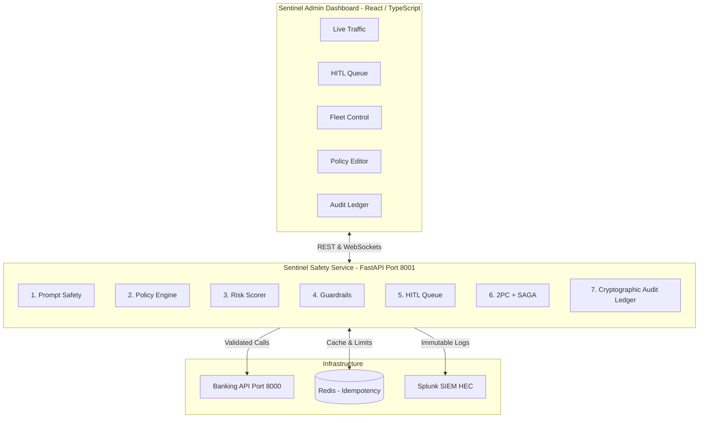
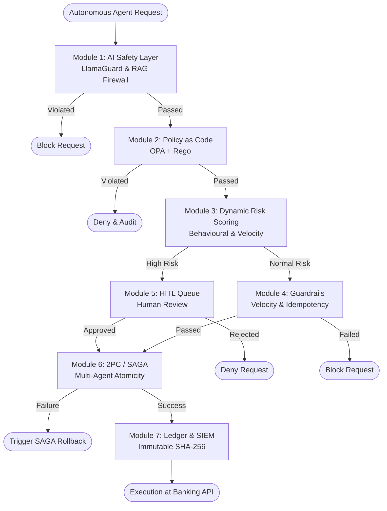

# Sentinel — Enterprise Governance Infrastructure for Autonomous Financial AI Agents

---

## Executive Summary

Financial institutions are rapidly entering an era where autonomous AI agents execute high-stakes operations — processing payments, resolving disputes, adjusting credit limits, managing treasury allocations, and servicing millions of customers in real time — far faster than any human team can supervise. However, speed without governance is catastrophic. A single misaligned agent can execute thousands of unauthorized transactions within seconds. Prompt injection attacks can corrupt reasoning mid-flight. Cascading multi-agent failures can amplify minor errors into systemic financial risk. Furthermore, static permission models designed for human users were never built to handle agents making ten thousand decisions per minute.

**Sentinel bridges this governance gap.** Sentinel is a fully working, production-ready Zero Trust Governance Control Plane built and demonstrated live. Sentinel intercepts every autonomous agent action **before execution** and evaluates it through seven sequential governance layers. Only actions passing all seven layers reach underlying banking infrastructure. Everything else is blocked, escalated, or compensated automatically.

---

## The Core Problem: The Autonomous AI Governance Gap

Traditional cyber-security and access management paradigms fail when applied to autonomous AI agents:

* **Static RBAC Incompatibility:** Human-centric Role-Based Access Control (RBAC) relies on predefined user roles and static access scopes. AI agents generate dynamic tool arguments, call parameters, and complex reasoning graphs that static permission models cannot evaluate contextually.
* **Prompt Injection & Context Poisoning:** Adversaries can bypass systemic instructions via indirect prompt injections or poisoned Retrieval-Augmented Generation (RAG) context, forcing agents into executing rogue financial transactions.
* **Cascading Multi-Agent Failures:** When autonomous agents interact in distributed workflows, partial execution failures across microservices lead to corrupted financial ledgers and uncoordinated systemic rollbacks.
* **High-Frequency Vulnerabilities:** Automated agents execute at speeds where duplicate execution attacks, rapid replay attempts, and sudden high-velocity spending sprees exceed human monitoring capabilities.

---

## High-Level System Architecture

Sentinel acts as an inline, zero-trust sidecar and governance gateway between autonomous AI agents and core banking APIs.

---

## Sequential Governance Execution Workflow

Every incoming agent invocation request is passed down a sequential 7-stage control pipeline. Failure at any early stage halts execution immediately, protecting downstream banking systems.

---

## Comprehensive Breakdown of the Seven Governance Modules

### Module 1 — AI Safety Layer (Prompt Injection & RAG Context Defense)

Every incoming agent instruction undergoes multi-signal scanning before reach. The system combines regex fingerprinting for known exploit signatures, semantic anomaly detection for latent malicious intent, and LlamaGuard classification for adversarial prompts. Simultaneously, a parallel RAG Memory Firewall inspects retrieved context documents against cryptographic hash registries, blocking poisoned knowledge bases before they corrupt agent reasoning.

### Module 2 — Policy as Code Engine (Open Policy Agent + Rego)

Per-agent and per-action authorization rules are evaluated deterministically using Open Policy Agent (OPA) running embedded Rego scripts. Rather than relying on binary permission flags, OPA evaluates multi-dimensional context: agent identity, action type, transaction amounts, customer risk profiles, and temporal constraints. Policy changes are versioned and take effect instantly across the fleet without service redeployment.

### Module 3 — Dynamic Risk Intelligence Scorer

Every action is dynamically assigned a risk score from 0 to 100 based on multi-factor telemetry: transaction magnitude, target account status, call graph depth, historical velocity, and behavioral anomalies. Actions scoring low risk proceed automatically; medium-risk actions route to human escalation; high-risk actions are blocked instantly.

### Module 4 — Financial Guardrails (Velocity, Limits & Idempotency)

This module enforces adaptive spending windows, hourly/daily transaction velocity thresholds, and concurrent execution limits per agent instance. A distributed idempotency engine backed by Redis detects and blocks duplicate execution replay attacks — preventing attackers from replaying authorized calls within short time windows.

### Module 5 — Human-in-the-Loop (HITL) Escalation Queue

Actions exceeding established risk thresholds are placed in a real-time queue. Human operators review requests on the Sentinel dashboard with complete contextual visibility: agent reasoning traces, policy parameters, risk scores, and affected account details. Operators can approve or reject actions with a single click.

### Module 6 — Two-Phase Commit (2PC) & SAGA Compensation

For multi-agent workflows spanning multiple ledgers, Sentinel enforces atomicity using a two-phase commit protocol. If any participating agent fails midway through an operation, the integrated SAGA orchestrator automatically executes compensating transactions across all affected services, preventing partial financial commits.

### Module 7 — Immutable Audit Ledger & Splunk SIEM Integration

All governance outcomes (allow, deny, escalate, compensate) are written to a tamper-proof, append-only audit ledger using SHA-256 forward-chaining. Each entry encodes the hash of the preceding record, making retrospective alterations cryptographically detectable. Additionally, events stream in real time to Splunk via HTTP Event Collector (HEC) for enterprise SIEM analysis and regulatory reporting.

---

## Emergency Fleet Control: Sub-Second Circuit Breaker

Sentinel provides operators with emergency control over the agent fleet. In the event of anomalous behavior or security breach, operators can initiate targeted isolation:

* **Single-Agent Quarantine:** Instantly revoke execution rights for a compromised agent instance without disrupting surrounding services.
* **Category Isolation:** Freeze specific functional classes of agents (e.g., credit limit adjustment agents) while leaving payment processing agents active.
* **Fleet-Wide Emergency Shutdown:** Suspend all active AI agent operations across the enterprise in **under 1 second**.

When an agent is quarantined, active transactions undergo immediate SAGA compensation, leaving no uncommitted financial state.

---

## Industry Comparison Matrix

| Capability | Standard Industry Practice | Sentinel Infrastructure |
| --- | --- | --- |
| Policy Enforcement | Static RBAC / Post-hoc check | Deterministic per-action OPA Rego evaluation |
| Audit Verification | Standard SQL/NoSQL logs | Cryptographically chained tamper-proof SHA-256 ledger |
| Duplicate Prevention | Basic application checks | Distributed Redis-backed TTL idempotency engine |
| Multi-Agent Safety | None / Manual recovery | 2PC Atomicity + Automated SAGA Compensation |
| Emergency Response | Manual script execution | <1 Second Emergency Fleet Kill Switch |
| SIEM Integration | File log forwarding | Structured Splunk HEC event streaming with SPL support |
| Risk Assessment | Hardcoded thresholds | Dynamic context-aware multi-factor risk scoring |

---

## Live Running System Components

Sentinel is deployed and fully operational with the following components:

1. **Sentinel Safety Service:** FastAPI core service running on port 8001 executing all 7 governance modules sequentially.
2. **Mock Banking API:** High-fidelity simulated core banking service on port 8000 handling multi-account ledgers, transfers, and credit operations.
3. **Sentinel Admin Dashboard:** React + TypeScript glassmorphism UI with live traffic streams, HITL review queues, policy editors, fleet management, and audit inspection.
4. **Customer Portal:** Interactive user interface (demo profiles: Adhi Kumar, Tara Williams) showing live account data backed by an AI assistant controlled by Sentinel in real time.
5. **Splunk SIEM Integration:** Configurable HTTP Event Collector (HEC) pipeline streaming full event telemetry for compliance reporting.

---

## Technology Stack

* **Frontend:** React, TypeScript, TanStack Router, Vite, Tailwind CSS
* **Governance Backend:** Python, FastAPI, LangGraph, LangChain, Open Policy Agent (OPA/Rego)
* **Data & Infrastructure:** Redis, Docker, Prometheus, Splunk HEC Integration

---

## Operational & Regulatory Impact

* **Execution Safety:** 100% of agent actions evaluated pre-execution; zero uninspected transactions reach financial ledgers.
* **Ultra-Low Overhead:** Average governance evaluation latency remains <15ms per action, preserving agent responsiveness.
* **Instant Quarantine:** Time-to-revoke compromised agents reduced from hours to under 1 second.
* **Audit Assurance:** Cryptographically guaranteed, immutable audit records built specifically for compliance and regulatory verification.

---

*Sentinel — Enterprise Governance Infrastructure for Autonomous Financial AI Agents*

*Repository: [https://github.com/Adhi0303/Sentinal-*](https://github.com/Adhi0303/Sentinal-)
